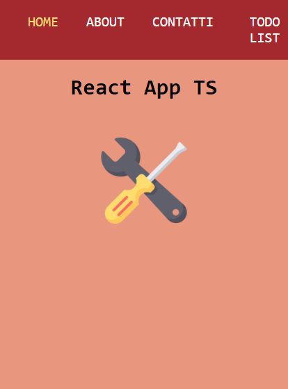
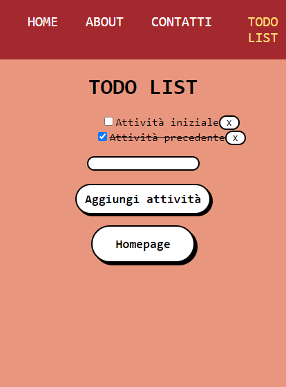

# React App TS

> <b>Autore: Nicola De Nicolais</b>

Questo codice rappresenta un'applicazione creata con Vite.js basata su template React TypeScript con l'aggiunta di React Router. All'interno dell'app sono presenti delle sezioni tra cui una Todo list che permette di generare una lista nella quale si può aggiungere, selezionare e cancellare un'attività.

## Tecnologie utilizzate
⚡ [Vite](https://vitejs.dev)

Vite.js è un tool di sviluppo molto più leggero in termini di dipendenze e permette di impostare un ambiente di sviluppo moderno per framework come Vue, React e per JavaScript Vanilla. Caratterizzato da un modulo HMR e da un bundler di moduli per JavaScript, Rollup.

💠 [React](https://reactjs.org/)

React.js è una libreria JavaScript per la creazione di interfacce utente specifiche per applicazioni a singola pagina. Consente agli sviluppatori di creare applicazioni web di grandi dimensioni in grado di modificare i dati senza dover ricaricare ogni volta la pagina.

📍 [React Router](https://reactrouter.com/)

React Router è una libreria di routing completa per JavaScript che consente di gestire i percorsi all’interno di un’applicazione web utilizzando utilizzando il cosiddetto routing dinamico. Consente la navigazione tra le sezioni di vari componenti presenti nelle applicazioni React e permette di modificare l’URL del browser mantenendo l’interfaccia utente sincronizzata con l’URL.
## Installazione
Nella cartella del progetto possiamo eseguire diverse azioni:

1) Clona questa repository da GitHub. Apri il terminale ed esegui `git clone https://github.com/ndenicolais/react-app-ts`

2) Nel terminale esegui    `cd react-app-ts-main` per entrare nella cartella del progetto.

3) Esegui `yarn` per installare le dipendenze richieste per l'applicazione.

4) Esegui `yarn dev` per avviare l'applicazione in modalità sviluppatore.
Apri http://localhost:3000 per visualizzare l'applicazione nel browser.

## Screen  applicazione
### Homepage

### Todo List
