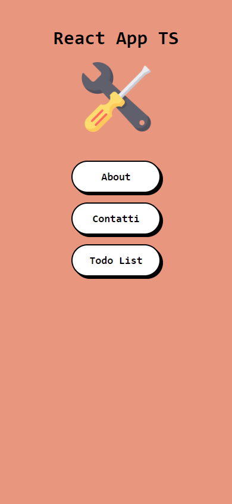

# Todo list

> <b>Autore: Nicola De Nicolais</b>

Questo codice rappresenta un'applicazione creata con Vite.js basata su un template React TypeScript con l'aggiunta di React Router. All'interno dell'app vi è acnhe una Todo list che crea una lista nella quale si può aggiungere, selezionare e cancellare un'attività.

## Tecnologie utilizzate
⚡ [Vite](https://vitejs.dev)

Tool per sviluppo di progetti web con caratteristiche molto vantaggiose:
- 💡 Avvio immediato del server senza che file vengano necessariamente raggruppati.
- ⚡️ Hot Module Replacement che permette di cambiare, aggiungere o rimuovere i moduli mentre un applicazione viene eseguita.
- 📦 Build ottimizzata con il plugin Rollup che supporta modalità multi-pagina e libreria.
- 🛠️ API con pieno supporto TypeScript, JSX, CSS e altro.

💠 [React](https://reactjs.org/)

Libreria di sviluppo UI basata su JavaScript che offre varie estensioni per diversi tipi di applicazioni. React permette:
- 📦 Facile creazione di applicazioni web e mobili dinamiche con meno codifica e offre più funzionalità.
- ⚡️ Prestazioni migliorate grazie al Virtual DOM.
- 🔩 Componenti riutilizzabili  in tutta l'applicazione.
- 📊 Flusso di dati unidirezionale.
- 🛠️ Strumenti dedicati per facilitare il debug.

📍 [React Router](https://reactrouter.com/)
## Installazione
Nella cartella del progetto possiamo eseguire diverse azioni:

1) Clona questa repository da GitHub. Apri il terminale ed esegui `git clone https://github.com/ndenicolais/react-app-ts`

2) Nel terminale esegui    `cd react-app-ts-main` per entrare nella cartella del progetto.

3) Esegui `yarn` per installare le dipendenze richieste per l'applicazione.

4) Esegui `yarn dev` per avviare l'applicazione in modalità sviluppatore.
Apri http://localhost:3000 per visualizzare l'applicazione nel browser.

## Screen  applicazione
