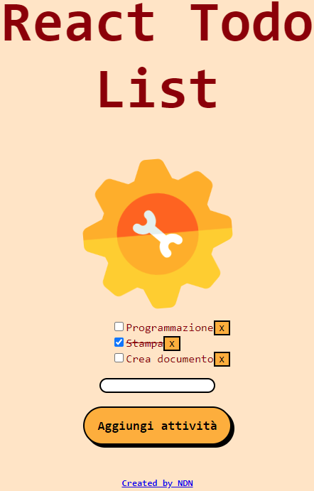

# Todo list

> <b>Autore: Nicola De Nicolais</b>

Questo codice rappresenta una Todo list creata con Vite.js basata su un template React Typescript

## Tecnologie utilizzate
- 📦 [Node](https://nodejs.org/)
- ⚡ [Vite](https://vitejs.dev)
- 🌐 [React](https://reactjs.org/)
## Struttura
- 📂 public  
contiene le risorse come il file "index.html", immagini, icone, etc...
- 📂 src  
contiene il codice sorgente per far funzionare l'applicazione

  Internamente alla cartella ci sono:

- AddTodo.tsx
- App.tsx
- TodoList.tsx
- TodoListItem.tsx

## Installazione
Nella cartella del progetto possiamo eseguire diverse azioni:

1) Clona questa repository da GitHub. Apri il terminale ed esegui `git clone https://github.com/ndenicolais/todo-list-react-ts`

2) Nel terminale esegui    `cd todo-list-react-ts-main` per entrare nella cartella del progetto.

3) Esegui `yarn` per instalalre le dipendenze richieste per l'applicazione.

4) Esegui `yarn dev` per avviare l'applicazione in modalità sviluppatore.
Apri http://localhost:3000 per visualizzare l'applicazione nel browser.

## Screen  applicazione

