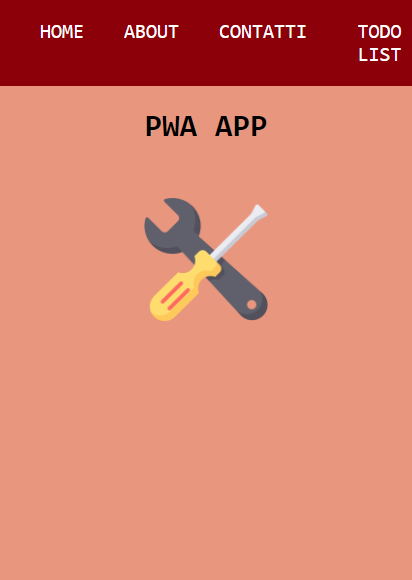
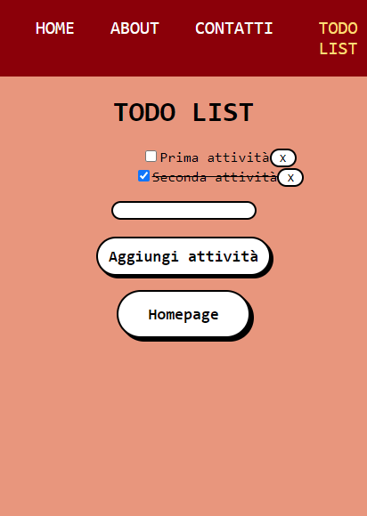

# PWA APP

> <b>Autore: Nicola De Nicolais</b>

This code represents a Progressive Web Application created with Vite.js based on React TypeScript template with the addition of React Router. Within the app there are sections including a Todo list that allows you to generate a list in which you can add, select and delete a task.

## Technologies used
⚡ [Vite](https://vitejs.dev)

Vite.js is a much lighter development tool in terms of dependencies and allows you to set up a modern development environment for frameworks such as Vue, React and for JavaScript Vanilla. Featuring an HMR module and a bundler of modules for JavaScript, Rollup.

💠 [React](https://reactjs.org/)

React.js is a JavaScript library for creating user interfaces specific to single-page applications. It allows developers to create large web applications that can modify data without having to reload the page every time.

📍 [React Router](https://reactrouter.com/)

React Router is a complete JavaScript routing library that allows you to manage paths within a web application using so-called dynamic routing. It allows navigation between sections of various components in React applications and allows you to change the URL of the browser while keeping the user interface synchronized with the URL.

## Local development
In the project folder we can perform several actions:

1) Clone this repository from GitHub. Open the terminal and run `git clone https://github.com/ndenicolais/pwa-app`

2) In the terminal run    `cd pwa-app-main` to enter the project folder.

3) Run `yarn` to install the required dependencies for the application.

4) Run `yarn dev` to start the application in developer mode.
Open http://localhost:3000 to view the application in the browser.

## Screen  app
### Homepage

### Todo List
